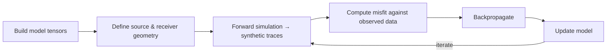

# Project Overview

TIDE is a PyTorch-first electromagnetic modeling and inversion library built around finite-difference time-domain (FDTD) Maxwell solvers.

## What You Can Do With TIDE

-   :material-numeric-2-box:{ .lg .middle } **2D TM Forward Modeling**

    ---
    Run 2D TM-mode forward simulations with `tide.maxwelltm`, including CPML absorbing boundaries.

-   :material-numeric-3-box:{ .lg .middle } **3D Forward Modeling**

    ---
    Run full 3D forward simulations with `tide.maxwell3d` using high-order finite-difference stencils.

-   :material-gradient-horizontal:{ .lg .middle } **Gradient Computation**

    ---
    Autodiff with respect to `epsilon` and `sigma`, integrating directly with PyTorch optimizers.

-   :material-rotate-3d:{ .lg .middle } **Inversion Loops**

    ---
    Build complete inversion workflows in raw PyTorch or with `MaxwellTM` / `Maxwell3D` modules.

## Core Concepts

| Concept | Description |
|---------|-------------|
| Model tensors | `epsilon`, `sigma`, `mu` — shaped to match the grid |
| Source amplitude | Shape `[n_shots, n_sources, nt]` |
| Receiver traces | Returned as `[nt, n_shots, n_receivers]` |
| Boundary conditions | CPML absorbing boundaries, finite-difference stencils, CFL-driven internal resampling |

### Coordinate Conventions

!!! info "Axis Ordering"
    - **2D TM**: uses `[y, x]` layout
    - **3D**: uses `[z, y, x]` layout

## Typical Workflow

## Recommended Learning Path

!!! example "Learning Path"
    1. Run a small 2D forward example from `getting-started.md`
    2. Read `guides/api-orientation.md`
    3. Read `guides/modeling.md`
    4. Read `guides/inversion.md`
    5. Before scaling up, review `guides/configuration.md`, `guides/limitations.md`, and `guides/verification.md`
