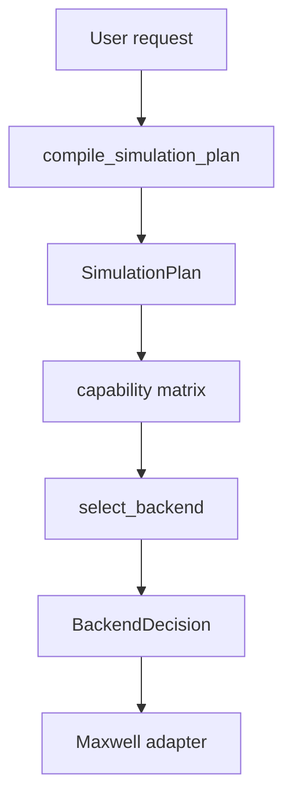

`tide.core` normalizes execution requests before a physics adapter runs. It provides one dispatch contract for TM2D and EM3D instead of allowing each solver family to interpret backend and fallback options independently.

Most application code does not need to call these functions directly. They are useful for configuration validation, capability inspection, and backend diagnostics.

## Planning flow



`compile_simulation_plan` records dimension, derivative operation, model dtype and device, requested gradient targets, storage mode, callback use, component selection, batching, reference execution mode, and fallback policy.

```python
from tide import compile_simulation_plan

plan = compile_simulation_plan(
    operation="forward",
    dimension="tm2d",
    epsilon=epsilon,
    storage_mode="device",
)
```

Physics-specific validation remains in the Maxwell layer. A valid plan does not prove that source coordinates, material values, CFL ratio, or component names are physically valid.

## Operations

The normalized operation vocabulary is:

- `forward`: nonlinear propagation.
- `jvp`: tangent or Born action $Jv$.
- `vjp`: adjoint action $J^\top r$.
- `second_vjp`: nonlinear second-order action $(DJ[v])^\top r$.

Using derivative semantics rather than historical solver names lets capability rows describe the public operator API directly.

## Backend selection

`select_backend(plan, native_available=...)` evaluates the requested plan against immutable capability rows. The resulting `BackendDecision` records selected backend, whether a fallback occurred, and the reason for an unsupported request.

```python
from tide import select_backend

decision = select_backend(plan, native_available=True)
print(decision.selected)
print(decision.used_fallback)
```


A request for `BackendPreference.NATIVE` is never silently converted to another implementation when `FallbackPolicy.ERROR` is active. With `FallbackPolicy.REFERENCE`, selection may choose the reference backend only when that backend advertises the complete requested capability.

## Capability matrix

```python
from tide.core.backends import backend_capabilities

capabilities = backend_capabilities(tide.BackendPreference.NATIVE)
for row in capabilities.matrix:
    print(row.dimension, row.operations, row.storage_modes)
```

Each `BackendCapability` row covers:

- Dimension.
- Operation set.
- CPU or CUDA device.
- Float32 or float64 dtype.
- Compute mode.
- Snapshot storage modes.
- Callback support.
- Reusable background support.
- Gradient targets.

The matrix is the executable source of truth. The [rendered capability table](/tide-GPR/dev/feature-matrix/) is a readable snapshot and should be updated with code changes.

## Main enums and values

| Type | Important values |
| --- | --- |
| `Dimension` | `TM2D`, `EM3D` |
| `Operation` | `FORWARD`, `JVP`, `VJP`, `SECOND_VJP` |
| `BackendPreference` | `AUTO`, `REFERENCE`, `NATIVE` |
| `FallbackPolicy` | `REFERENCE`, `ERROR` |
| `GradientTarget` | `EPSILON`, `SIGMA`, `MU`, `PERTURBATION`, `SOURCE`, `STATE` |
| `StorageMode` | `AUTO`, `DEVICE`, `CPU`, `DISK`, `NONE` |

`SimulationPlan`, `BackendDecision`, `BackendCapability`, and `BackendCapabilities` are immutable value objects. Treat them as diagnostic records, not mutable runtime configuration.

## Why planning is centralized

Without a central plan, one public entry point could silently fall back while another raises, or two solvers could interpret the same storage string differently. Central planning provides:

- One operation vocabulary.
- One fallback rule.
- One capability table.
- One place to test unsupported combinations.
- Error messages that identify the rejected capability rather than failing inside a kernel.

New execution features must extend the plan and capability matrix before backend plumbing is added. This keeps unsupported cells explicit.
