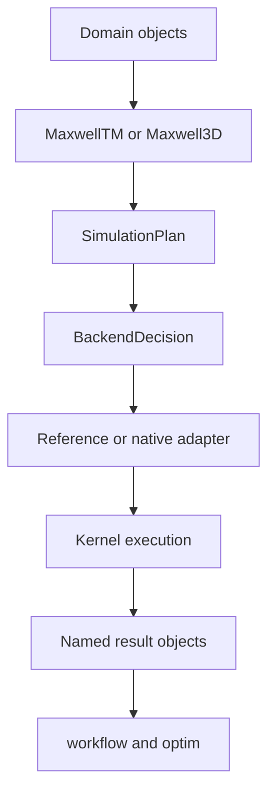

TIDE is maintained as one Maxwell-focused package. The package is split into
four dependency layers:

```text
public API (tide.__init__, tide.maxwell)
        |
        v
core contracts (plan, types, capability decisions)
        |
        v
solver implementations (reference Python and native adapters)
        |
        v
C/CUDA kernels and ABI declarations
```

The `workflow` and `optim` packages are consumers of the public solver API;
the solver must not import either package. `core` contains only cross-cutting
execution contracts and must not import a solver, workflow, or optimizer.

## Stable versus internal code

The supported surface is the API exported by `tide.__all__` and
`tide.maxwell.__all__`. Files under `tide.maxwell` that end in `_python`,
`_cuda`, or `_autograd` are implementation details. A change to them is safe
to review as an internal change only when the public behavior and numerical
parity tests remain unchanged.

Research prototypes, generated outputs, large datasets, and profiling scripts
stay outside the supported package and documentation surfaces. A prototype is
promoted only when it has a stable API, a reference path, capability coverage,
tests, and user documentation.

## Execution contract

Public operators compile each request into `SimulationPlan`, pass it through
`tide.maxwell.dispatch.ExecutionPolicy`, ask the central capability matrix for
a `BackendDecision`, and then call one execution adapter. Forward, JVP, VJP,
and second-VJP paths in TM2D and EM3D use this transition. New options must be
represented in the plan and matrix before reaching a kernel. Unsupported
combinations either select the declared reference fallback or raise a
descriptive error.

## Dependency rules

The following import directions are enforced by tests:

- `core` may depend on the standard library and PyTorch, but not on solvers,
  workflow, optimizers, or the native ABI loader;
- `maxwell` may depend on `core` and shared numerical utilities, but not on
  `workflow` or `optim`;
- `optim` is self-contained and must not depend on `maxwell`, `workflow`, or
  `core`;
- `workflow` may consume public solver behavior, but solver code cannot depend
  on workflow helpers.

## Operator data flow



The public operator owns model-independent configuration. `EMModel` remains an
input. Linearization fixes one background model and owns the lifetime of
primal snapshots used by JVP, VJP, and second-VJP actions.

## Result boundary

Native and reference kernels may return different internal tuples, but public
callers receive `ForwardResult`, `TangentResult`, dimension-specific state, and
`EMGradient`. Adapter code is responsible for converting internal ordering into
these named values.

Workflow code must not inspect tuple positions or import a kernel adapter. This
keeps shot batching, objectives, and optimizers independent of backend layout.

## Numerical parity boundary

A native optimization is complete only when it matches the reference path for
the public quantity it implements:

- Receiver traces and final state for forward.
- Tangent receiver traces for JVP.
- Material gradients for VJP.
- Nonlinear material products for second VJP.

Tests should also cover rejected cells, fallback decisions, storage modes, and
resource cleanup. Compilation success alone is not evidence of parity.

## State ownership

Operators do not own trainable parameters. Linearized sessions may own cached
primal graphs, device snapshots, host buffers, and temporary files. Workflow
helpers own only indexing and composition. Optimizers own only algorithm state.

This ownership split prevents hidden model mutation and makes resource lifetime
visible at the API boundary.
