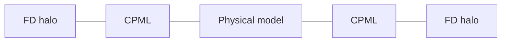

A finite grid has artificial edges. Without an absorbing boundary, outgoing energy reflects from those edges and returns to the receivers as a false event. TIDE surrounds the physical model with convolutional perfectly matched layers, or CPML, and adds the finite-difference halo required by the selected stencil.

## Domain layout

From the inside out, a propagated field contains:

1. The physical model supplied by the user.
2. CPML cells that attenuate waves approaching each edge.
3. A finite-difference halo used by high-order derivative stencils.

Source and receiver indices are expressed in physical-model coordinates. TIDE handles the offset into the padded propagation domain.



## Configuring CPML width

A scalar width applies the same number of cells to every side:

```python
discretization = tide.Discretization(
    spacing=0.02,
    dt=4.0e-11,
    stencil=4,
    boundary=tide.CPML(12),
)
```

Per-side widths follow natural axis order:

| Dimension | Width tuple |
| --- | --- |
| 2D | `(y0, y1, x0, x1)` |
| 3D | `(z0, z1, y0, y1, x0, x1)` |

A zero width disables CPML on that side. This can represent a deliberate boundary treatment, but it also allows reflection. Verify the resulting physics instead of using zero only to save memory.

## Choosing a width

CPML performance depends on wavelength, incidence angle, material contrast near the edge, time window, and profile parameters. A width between roughly 8 and 20 cells is a useful starting range, not a guarantee.

Use an empirical reflection test:

1. Build a homogeneous model larger than the intended travel path.
2. Place a source and receiver so the direct arrival is separated from the boundary return.
3. Run with the planned spacing, source, stencil, and CPML width.
4. Measure late-time energy after the direct wave has passed.
5. Increase width until the reflected energy is below the study's tolerance.

Repeat this test when the source bandwidth or boundary-adjacent material changes substantially.

## Stencil order and halo width

TIDE supports stencil orders 2, 4, 6, and 8. Higher order usually reduces phase error at fixed grid spacing, but it increases arithmetic work and halo width. CPML and stencil padding solve different problems: CPML absorbs outgoing energy, while the halo provides neighbors required by the derivative operator.

Do not compare stencil orders only by runtime per step. A higher-order stencil may permit a coarser grid for the same dispersion error, but that trade-off must be established with a convergence test.

## Sources and receivers near a boundary

A source inside or immediately beside CPML can be attenuated before the intended wave develops. A receiver near CPML may record the absorption profile rather than the physical field of interest. Keep both inside the physical domain with enough separation for the desired wavefield to form.

For surface surveys, a reflective or free-surface treatment may be part of the physical model. CPML on every side is not automatically correct. If the current public solver cannot represent the required boundary condition, do not imitate it by placing a source on the CPML edge.

## Callback views

`CallbackState` exposes three spatial views:

- `inner`: physical model interior.
- `pml`: physical model plus CPML.
- `full`: CPML plus finite-difference halo.

Use `inner` for most plots and physical diagnostics. Use `pml` or `full` when diagnosing boundary behavior, indexing, and auxiliary-field support.

## Diagnosing boundary contamination

Boundary reflections often have these signatures:

- An event arrives at a time consistent with a path to the box edge and back.
- The event moves when CPML width or model extent changes.
- Late-time energy concentrates near one side in callback snapshots.
- The event persists in a homogeneous model where no physical reflector exists.

Change one factor at a time. Increasing model extent tests travel-time separation, increasing CPML width tests absorption, and refining the grid tests numerical dispersion.

## Verification checklist

Before accepting a production setup:

1. Confirm width ordering for every axis.
2. Confirm sources and receivers are in the physical interior.
3. Compare late-time traces at two CPML widths.
4. Inspect an `inner` and `pml` callback snapshot.
5. Repeat after changing source bandwidth, spacing, or stencil order.

See [modeling](/tide-GPR/guides/modeling/) for resolution choices and [callbacks](/tide-GPR/guides/callbacks/) for inspecting wavefields.
