TIDE is a PyTorch-first electromagnetic modeling and inversion library. It solves time-domain Maxwell equations on staggered finite-difference grids, records synthetic receiver traces, and exposes derivatives with respect to material properties without constructing a dense Jacobian.

## What TIDE calculates

For a fixed acquisition and discretization, TIDE treats simulation as a nonlinear operator

$$
F(m)=d,
$$

where $m=(\epsilon_r,\sigma,\mu_r)$ is the material model and $d$ is the sampled receiver data. The fixed parts of an experiment, including grid spacing, time step, source wavelet, source positions, receiver positions, boundary width, and backend policy, are stored on a `MaxwellTM` or `Maxwell3D` operator. The model remains an explicit input, so an inversion loop can evaluate the same experiment at many candidate models.

TIDE also exposes the actions required by first and second-order inverse methods:

| Operation | Mathematical action | Typical use |
| --- | --- | --- |
| Forward | $F(m)$ | Synthetic traces and validation |
| JVP | $J(m)v$ | Born data and Gauss-Newton products |
| VJP | $J(m)^\top r$ | Model gradients from receiver residuals |
| Second VJP | $(DJ(m)[v])^\top r$ | Nonlinear term in a full Hessian product |

These operations use propagated wavefields and dedicated derivative paths. They do not materialize $J(m)$.

## Physics available

### 2D transverse magnetic modeling

`MaxwellTM` evolves the `Ey`, `Hx`, and `Hz` field components on a 2D `[y, x]` grid. It is the best entry point for planar experiments, API learning, gradient checks, and fast iteration.

### Full 3D modeling

`Maxwell3D` evolves all six electric and magnetic components on a `[z, y, x]` grid. Use it when out-of-plane propagation, component orientation, or genuinely three-dimensional geometry changes the result.

### Material models

The default constitutive model uses relative permittivity `epsilon`, conductivity `sigma` in S/m, and relative permeability `mu`. Optional `DebyeDispersion` adds a single-pole dielectric response. Material tensors must share shape, dtype, and device.

## Data model

| Quantity | Shared-model shape | Meaning |
| --- | --- | --- |
| 2D material | `[ny, nx]` | One TM material model |
| 3D material | `[nz, ny, nx]` | One full Maxwell model |
| Source amplitude | `[n_shots, n_sources, nt]` | Source time functions |
| 2D locations | `[n_shots, n_points, 2]` | Integer `[y, x]` indices |
| 3D locations | `[n_shots, n_points, 3]` | Integer `[z, y, x]` indices |
| Receiver data | `[nt, n_shots, n_receivers]` | Recorded component samples |

TIDE also accepts batched material models. In that case, the model batch axis is first and the returned receiver tensor is `[nt, batch, n_shots, n_receivers]`.

:::caution[Coordinates are indices]
Source and receiver coordinates are integer grid indices, not physical distances. Convert survey coordinates to indices using the same origin and spacing used to construct the model.
:::

## What happens during a forward call

```mermaid
graph LR
    A[Validate model and geometry] --> B[Resolve backend and capabilities]
    B --> C[Choose CFL-safe internal dt]
    C --> D[Upsample source if needed]
    D --> E[Pad model and construct CPML]
    E --> F[Advance staggered fields]
    F --> G[Sample receiver component]
    G --> H[Downsample to user dt]
    H --> I[Return receiver data and final state]
```

The user-facing `dt` is the sampling interval of source and receiver data. If it is too large for stable FDTD propagation, TIDE chooses an integer sub-step ratio, upsamples the source internally, and downsamples receiver traces before returning them. The public time axis therefore remains unchanged.

## Forward and inverse workflows

A forward study normally follows this order:

1. Choose grid spacing from the shortest wavelength that must be resolved.
2. Select a stable and useful source sampling interval.
3. Build the material model and acquisition tensors.
4. Run a small homogeneous model to validate arrival time and polarity.
5. Add heterogeneity, more shots, and higher stencil order only after the baseline is understood.

An inverse problem adds observed traces, an objective function, constraints, and repeated model updates. TIDE deliberately keeps these choices outside the Maxwell operator so PyTorch losses, filters, regularizers, and optimizers remain composable.

## Recommended learning path

1. [Run the first model](/tide-GPR/getting-started/).
2. [Understand the domain objects](/tide-GPR/guides/api-orientation/).
3. [Choose a grid and physical model](/tide-GPR/guides/modeling/).
4. [Build source and receiver tensors](/tide-GPR/guides/sources-receivers/).
5. [Understand CPML and stencil accuracy](/tide-GPR/guides/boundaries/).
6. [Construct an inversion loop](/tide-GPR/guides/inversion/).
7. [Verify the selected runtime path](/tide-GPR/guides/verification/).
